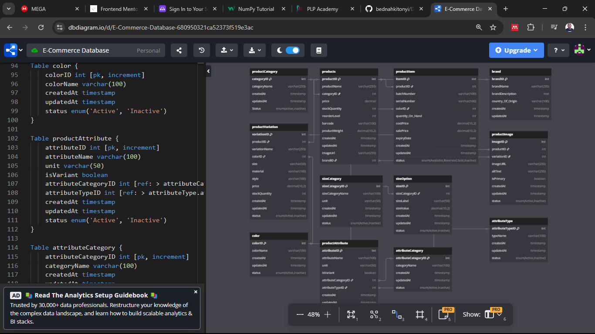

# 🛒 E-Commerce Database Design

---

## 📖 Overview

This project is an **E-commerce Database Design** built as a peer group assignment under Power learn project. It includes an **Entity Relationship Diagram (ERD)** and a fully implemented MySQL database schema designed to manage key components of an online retail system including products, categories, variations, and attributes.

---

## 🎯 Objective

To design and implement an e-commerce database collaboratively that:
- Has relational database design principles
- Supports flexible product variation and attribute handling
- Facilitates future scalability

---

## 🧠 Technologies Used

- 🐬 **MySQL** 
- 🧱 ERD Design Tool: *dbdiagram.io*

---

## 🧱 Schema Overview

The schema includes tables covering the following:

| Table Name             | Purpose                                           |
|------------------------|---------------------------------------------------|
| `product`              | Main product listing                             |
| `product_category`     | Categorization of products                        |
| `product_item`         | Track individual items by batch or serial        |
| `brand`                | Brand information                                |
| `product_variation`    | Different versions of the same product           |
| `product_image`        | URLs and references for product photos           |
| `color`                | Available product colors                         |
| `size_category`        | Logical grouping of size options                 |
| `size_option`          | Specific size definitions (S, M, L, etc.)        |
| `product_attribute`    | Extra specs e.g. material, weight                |
| `attribute_category`   | Categories for attributes                        |
| `attribute_type`       | Defines the format of attributes                 |

---

## ✅ Features

1. Categorization of products through product categories
2. Inventory tracking with batch and serial number support
3. Management of product attributes (e.g., weight, storage) and custom attributes
4. Support for product variations (e.g., color, size, material)
5. Multiple images per product and variation
6. Color and size configuration for filtering and display
7. Full relational integrity using foreign key constraints
8. Timestamps for creation and modification tracking

## 🔄 Data Flow & Relationships

The ERD below shows how entities are interrelated in the system.

---

## 📊 Entity Relationship Diagram (ERD)

> 🖼️ *Below is the ERD diagram for the E-Commerce Database*
> *dbdiagram.io* [ERD Diagram Link](https://dbdiagram.io/d/E-Commerce-Database-680950321ca52373f519e3ac)

---

## 🚀 Setup Instructions

1. Clone the repo
2. Import `ecommerce.sql` into MySQL
3. Run the schema in your database (e.g., MySQL Workbench)
